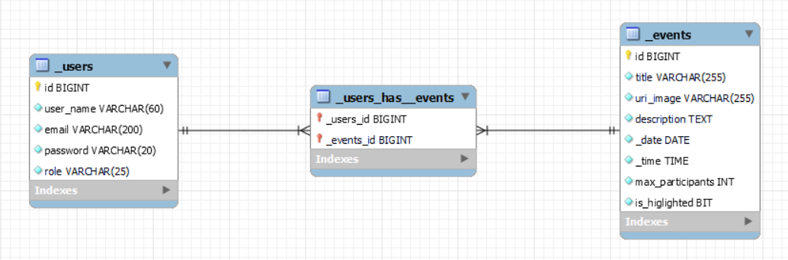

# Tech Events

A software development collective wants to create a web application to manage their online events (workshops, masterclasses, webinars, etc)
The users would be able to see the description of a given event, sign up and unsign.
They also would be able to see a list of the events they are signed in.
The admin should have the tools in order to manage the events.

This is the repo for the back side of the project.
You can check the front at: [TechEvents-Front](https://github.com/mihaelagheorghiu10/TechEvents-frontt)

## Team Members

[Badr El kahouaji](https://github.com/badr151)
[Daniel Gallego López](https://github.com/Daniel-gallegO)
[Esther Reyes](https://github.com/Seyerte)
[Gustavo Ardaya Zubieta](https://github.com/GustavoArdaya)
[Jaume Vidal Buenafuente](https://github.com/JaumeViBu)
[Mihaela Gheorghiu](https://github.com/mihaelagheorghiu10)

## Initial EER Diagram

## Available API endpoints
- `Base Url: /api/v1`
- `Events`
  - `Get All: /events`
  - `Get by Id: /events/:id`
  - `Get Users Signed In Event By Event Id: /events/:eventId/users`
  - `Sign Current Logged User Up For Event: /events/signup/:id`